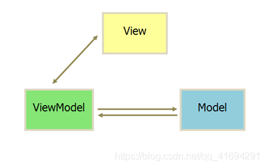

# 一.介绍

Vue 是一个现代 JavaScript 框架提供了有用的设施渐进增强——不像许多其他框架，你可以使用 Vue 增强现有的 HTML。这使你可以使用 Vue 作为 jQuery 等库的直接替代品。

Vue 组件设计成为由管理应用数据的 JavaScript 对象和映射到底层 DOM 结构的 html 模板语法组成的混合体。

# 二.Vue渲染机制

MVVM双向数据绑定：

- model业务层：业务层负责管理数据
- view视图层：视图层负责页面渲染
- view-model绑定层：绑定层负责双向绑定，即视图层操作通过绑定层影响业务数据，业务数据的变化通过绑定层影响视图渲染

# 三.Vue生命周期

Vue实例从创建 到销毁的过程 ，这些过程中会伴随着一些函数的自调用。我们称这些函数为钩子函数

| beforeCreate  | 在实例初始化之后，数据观测和事件配置之前被调用 此时data 和 methods 以及页面的DOM结构都没有初始化   什么都做不了 |
| ------------- | ------------------------------------------------------------ |
| created       | 在实例创建完成后被立即调用此时data 和 methods已经可以使用  但是页面还没有渲染出来 |
| beforeMount   | 在挂载开始之前被调用   此时页面上还看不到真实数据 只是一个模板页面而已 |
| mounted       | el被新创建的vm.$el替换，并挂载到实例上去之后调用该钩子。  数据已经真实渲染到页面上  在这个钩子函数里面我们可以使用一些第三方的插件 |
| beforeUpdate  | 数据更新时调用，发生在虚拟DOM打补丁之前。   页面上数据还是旧的 |
| updated       | 由于数据更改导致的虚拟DOM重新渲染和打补丁，在这之后会调用该钩子。 页面上数据已经替换成最新的 |
| beforeDestroy | 实例销毁之前调用                                             |
| destroyed     | 实例销毁后调用                                               |

